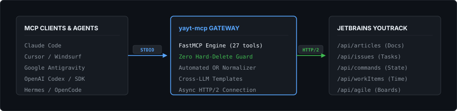

<p align="right">
  <strong>English</strong> · <a href="./README.ru.md">Русский</a>
</p>

<p align="center">
  
</p>

<p align="center">
  <a href="https://www.python.org/"></a>
  <a href="https://modelcontextprotocol.io/"></a>
  <a href="https://www.jetbrains.com/youtrack/"></a>
  <a href="https://github.com/uneconomicuse/yayt-mcp"></a>
  <a href="https://github.com/uneconomicuse/yayt-mcp/blob/main/LICENSE"></a>
</p>

---

## Overview

**`yayt-mcp`** (**Yet Another YouTrack MCP**) is a production-grade, token-efficient **[Model Context Protocol (MCP)](https://modelcontextprotocol.io/)** server connecting AI coding assistants directly to **JetBrains YouTrack**.

Built on Python 3.10+ with FastMCP and an asynchronous HTTP/2 client (`httpx`), it provides 27 purpose-built tools allowing LLMs to search articles, manage tasks, apply batch commands, track time, and monitor project activity without UI context switching.

---

<p align="center">
  
</p>

---

## Requirements

* **Python:** `3.10` or higher (`python --version`)
* **Git:** Available in system PATH
* **YouTrack:** Cloud or Self-Hosted (Server) with a [Permanent Token](https://www.jetbrains.com/help/youtrack/cloud/manage-permanent-token.html)

---

## Installation & Management

### Install
```bash
pip install git+https://github.com/uneconomicuse/yayt-mcp.git
```
*After installation, the server executable **`yayt-mcp`** is globally available.*

### Update / Reinstall
To pull the latest updates or refresh binaries:
```bash
pip install --upgrade --force-reinstall git+https://github.com/uneconomicuse/yayt-mcp.git
```

### Uninstall
To completely remove the server from your system:
```bash
pip uninstall yayt-mcp -y
```

### Verify
```bash
# Check if the command is found in PATH:
yayt-mcp --help
```

---

## Setup & Configuration

### Option A: Project-Level Setup (Recommended for Teams)
Create a `.mcp.json` file in the root directory of your project repository and commit it to Git:

```json
{
  "mcpServers": {
    "youtrack": {
      "command": "yayt-mcp",
      "env": {
        "YOUTRACK_URL": "https://company.youtrack.cloud",
        "YOUTRACK_TOKEN": "${YOUTRACK_TOKEN}"
      }
    }
  }
}
```
*Any developer opening this repository in Cursor, OpenCode, VS Code, or Windsurf will automatically have YouTrack integration enabled.*

### Option B: Global Setup in your AI Agent
Add `youtrack` to your global agent settings (e.g. `~/.config/opencode/mcp.json`, `~/.cursor/mcp.json`, or Claude Desktop):

```json
{
  "mcpServers": {
    "youtrack": {
      "command": "yayt-mcp",
      "env": {
        "YOUTRACK_URL": "https://company.youtrack.cloud",
        "YOUTRACK_TOKEN": "perm:your-permanent-token-here"
      }
    }
  }
}
```

👉 **Looking for specific client instructions (Claude Code, Cursor, JetBrains, OpenCode, Hermes, Pi, etc.)?**  
See the full **[AI Agent Setup Guide](docs/agents.md)**.

---

## Core Capabilities

* **Knowledge Base & Articles:** Full CRUD operations on YouTrack articles, hierarchical tree traversal (`list_child_articles`), Markdown parsing, attachments, and article discussions.
* **Issues & Command Engine:** Full-text and structured YouTrack QL search with automated `OR`-clause rewriting, issue linking (`subtask of`, `relates to`, `depends on`, `duplicates`), and instant state transitions via native YouTrack commands (`POST /api/commands`).
* **Deterministic Safety (Zero Hard-Delete):** Destructive physical deletion (`HTTP DELETE`) is permanently disabled in the server core. All delete requests execute safe archival (**Soft-Delete**: `State Obsolete`), preserving full audit history, links, and attachments.
* **Cross-LLM Consistency:** Standardized templates (`bug`, `feature`, `task`, `incident`, `spike`, `daily`, `release`) ensure structured formatting regardless of which AI model generates the task.
* **Live Change Polling:** `poll_changes` retrieves recent modifications within a configurable time window ($N$ minutes) for daily catch-ups and blockers identification with minimal token overhead.
* **Time Tracking & Agile:** Log work duration (`1h 30m`), query Agile/Kanban boards, group sprint issues by columns, and look up team member logins.

---

## Environment Variables

| Variable | Required | Default | Example | Description |
|---|---|---|---|---|
| `YOUTRACK_URL` | **Yes** | — | `https://company.youtrack.cloud` | Base URL of your YouTrack instance. |
| `YOUTRACK_TOKEN` | **Yes** | — | `perm-cmFma...` | Permanent Token with Read/Write permissions. |
| `YOUTRACK_READ_ONLY` | No | `false` | `false` / `true` | When `true`, rejects all mutating operations at the gateway level. |

*(See [`.env.example`](.env.example) for a pre-configured template).*

---

## Tool Reference (27 Tools)

<details>
<summary><strong>Expand complete tool reference</strong></summary>

### Knowledge Base (Articles)
* `search_articles(query, project, limit)` — Full-text article search.
* `get_article(article_id)` — Get Markdown content, metadata, attachments, sub-articles, comments.
* `create_article(project_id, summary, content, parent_article_id)` — Create article or sub-article.
* `update_article(article_id, summary, content)` — Update article title/content.
* `delete_article(article_id)` — Permanently disabled for security.
* `list_child_articles(article_id)` — Tree navigation of child articles.
* `add_article_comment(article_id, text)` — Comment on article.

### Issues & Monitoring
* `search_issues(query, limit)` — Search issues with auto `OR`-rewrite.
* `get_issue(issue_id)` — Full issue card with fields, attachments, links, comments.
* `create_issue(project_id, summary, description)` — Create freeform issue.
* `create_issue_from_template(project_id, template, summary, section_data)` — Create standardized issue (`bug`, `feature`, `task`, `incident`, etc.).
* `list_templates()` — List standard templates and sections.
* `update_issue(issue_id, command, comment)` — Apply commands (e.g. `State Fixed Assignee alex Priority Critical`).
* `archive_issue(issue_id, reason)` — Soft-delete issue (`State Obsolete`).
* `delete_issue(issue_id)` — Safe delete (always performs Soft-Delete: `State Obsolete`).
* `link_issues(source_id, target_id, link_type)` — Link issues (`subtask of`, `relates to`, `depends on`, `duplicates`).
* `get_issue_history(issue_id, limit)` — Issue audit log / changelog.
* `poll_changes(query, since_minutes)` — Catch-up / monitor changes in last N minutes.

### Comments
* `add_comment(issue_id, text)` — Add Markdown comment to issue.
* `update_comment(issue_id, comment_id, text)` — Edit comment.
* `delete_comment(issue_id, comment_id)` — Permanently disabled for security.

### Time Tracking
* `get_work_items(issue_id)` — View logged time entries.
* `add_work_item(issue_id, duration, description, work_type, date)` — Log time (`1h 30m`).

### Agile, Projects & Users
* `get_agile_boards()` — List Scrum/Kanban boards.
* `get_sprint_board(board_id, sprint_id)` — Sprint issues by columns.
* `find_users(query, limit)` — Search team logins by name/email.
* `list_projects(limit)` — List projects.
* `get_current_user()` — Check connection and view profile.

</details>

---

## Testing

```bash
python -m pytest tests -v
```

---

## License
Released under the [MIT License](LICENSE).
